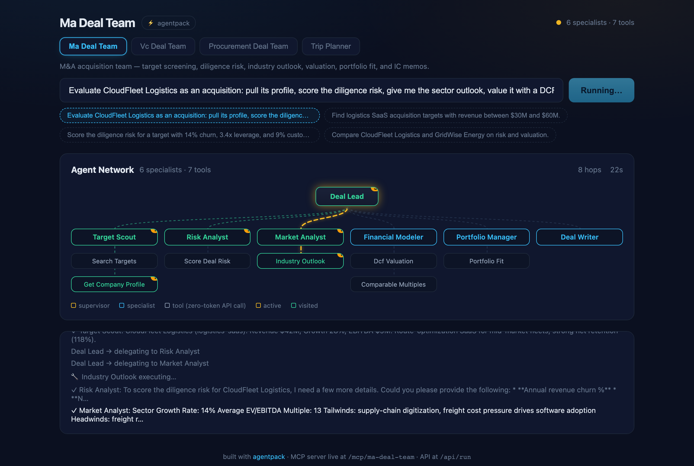
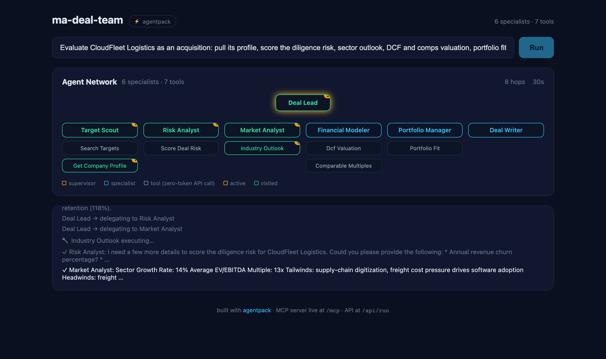

# ⚡ agentpack

**Define your AI agent team in one YAML file. Get a multi-agent supervisor, a live network UI, an MCP server, and a behavioral eval harness — out of the box. TypeScript.**

[](https://www.npmjs.com/package/@selvaonline/agentpack)
[](https://github.com/selvaonline/agentpack/actions/workflows/ci.yml)
[](LICENSE)
[](package.json)
[](https://langchain-ai.github.io/langgraphjs/)



*The built-in dev UI during a live run: switch between teams, click an example prompt, and watch the supervisor delegate across the network — animated dotted connectors trace every delegation, tools glow as they execute, every hop is streamed and counted. You write none of this.*

---

## Why

Multi-agent frameworks give you orchestration primitives and a blank screen. Everything that makes an agent team *demoable, debuggable, and trustworthy* — a UI that shows who's doing what, an MCP server so other agents can call your tools, evals that prove the team behaves — you build yourself, every time.

**agentpack inverts that.** The orchestration engine (LangGraph.js) is the boring part. The batteries are the product:

| You write | You get for free |
|---|---|
| `agentpack.yaml` — the team | LangGraph supervisor with delegation, retries, conversation memory |
| Prompts — markdown files | Live agent-network dev UI with hop-by-hop animation (SSE) |
| Tools — plain TS objects | Auto-generated MCP server (every tool, schemas derived, zero wrappers) |
| Eval cases — JSON | Behavioral eval harness: routing, completeness, refusal, latency budgets |

**Live demo:** [agentpack.selvaonline.com](https://agentpack.selvaonline.com) — the `deal-ma` template running on AWS: ask it to evaluate an acquisition and watch the six-agent network work. Its MCP server is public too: `https://agentpack.selvaonline.com/mcp`.

**Docs:** [selvaonline.github.io/agentpack](https://selvaonline.github.io/agentpack/)

## Five minutes to a running team

```bash
npx @selvaonline/agentpack init my-team
cd my-team && npm install
cp .env.example .env        # add ONE key: OpenAI, Gemini, or Groq
npm run dev                 # → http://localhost:3000
```

You now have a working travel-planning team — a supervisor delegating to a destination scout, a budget planner, and an itinerary writer over deterministic demo tools. Ask it:

> *Plan a 5-day trip to Japan in spring on a $3000 budget: research the destination, estimate the costs, and write a day-by-day itinerary.*

Then prove it behaves:

```bash
npm run eval                # routing / completeness / refusal — against the live server
```

```text
PASS routing_budget          agents=["budget_planner"] tools={"estimate_costs":1}
PASS completeness_full_plan  agents=["destination_scout","budget_planner","itinerary_writer"]
PASS honesty_refusal         agents=[]  (off-topic request: no delegation, polite decline)
```

## Templates: a full vertical team in one command

The starter team is a toy. The vertical templates are the product — complete teams with prompts, deterministic demo tools, and eval suites:

```bash
npx @selvaonline/agentpack templates                            # list available templates
npx @selvaonline/agentpack init my-fund      --template deal-vc
npx @selvaonline/agentpack init acquisitions --template deal-ma
npx @selvaonline/agentpack init coverage     --template equity-research
```

| Template | Team | Tools (deterministic demo data — swap for your APIs) |
|---|---|---|
| `deal-ma` | M&A acquisition team | target screening, weighted risk scoring, sector multiples, **real DCF math**, portfolio fit |
| `deal-vc` | VC investment team | deal-flow sourcing, founder/market risk, **TAM/SAM/SOM + dilution math**, fund-thesis fit |
| `deal-procurement` | Procurement sourcing team | vendor search, supplier risk, category intel, **TCO modeling**, spend concentration |
| `equity-research` | Equity research team | universe screening, **earnings-quality scoring**, DCF + peer multiples, initiation notes |
| `claims-triage` | Insurance claims triage | claim/policy lookup, **fraud scoring**, severity + reserve math, triage decisions |
| `support-triage` | Customer support triage | ticket queue, known-issue matching, **P1-P4 + SLA scoring**, drafted replies |
| `starter` | Trip-planning team | the gentlest possible introduction |



*The `deal-ma` template mid-run: Deal Lead delegating across all six roles. Every template ships with its own eval suite — all three pass 9/9.*

### Reshape the team in seconds

The "agent categories" are pure configuration. Remove the portfolio manager? Delete its block from `agentpack.yaml`, restart — 2 seconds. Add an ESG analyst? Add a block, a prompt file, and a tool:

```yaml
  - name: esg_analyst
    description: Screens deals for ESG red flags and reporting obligations.
    prompt: ./prompts/esg_analyst.md
    tools: [esg_screen]
```

The supervisor, the network UI, the MCP server, and the eval harness all pick up the new topology automatically — no code changes anywhere.

## The manifest is the framework

```yaml
# agentpack.yaml
name: trip-planner
title: Trip Planner Agent      # display name for the UI (optional)

supervisor:
  name: trip_advisor
  # prompt: ./prompts/supervisor.md   # optional — a disciplined default is generated

specialists:
  - name: destination_scout
    description: Researches destinations, attractions, and seasonal weather.
    prompt: ./prompts/destination_scout.md
    tools: [search_destinations, get_weather]

  - name: budget_planner
    description: Estimates trip costs and builds budget breakdowns.
    prompt: ./prompts/budget_planner.md
    tools: [estimate_costs]
    approval: true                   # human-in-the-loop: pause until the user approves

tools:
  - ./tools                          # directory of plain TS/JS modules — auto-discovered
  # - mcp:https://remote-host/mcp    # or pull every tool from a remote MCP server
```

Tools are **dependency-free duck-typed objects** — no imports from agentpack, trivially unit-testable, reusable anywhere:

```typescript
// tools/budget.ts
export const estimateCosts = {
  schema: {
    name: "estimate_costs",
    description: "Estimate total trip cost by region and travel style.",
    parameters: {
      type: "object" as const,
      properties: {
        region: { type: "string", description: "Asia | Europe | ..." },
        days: { type: "number", description: "Trip length in days" },
      },
      required: ["region", "days"],
    },
  },
  async execute({ region, days }) {
    return { totalPerPerson: /* deterministic math, zero LLM tokens */ };
  },
};
```

Edit the YAML, restart. That's the whole iteration loop.

## What `agentpack dev` serves

| Endpoint | What it does |
|---|---|
| `GET /` | Dev UI — live network graph, token streaming, hop animation, event feed, light/dark themes |
| `POST /api/run` | Run a query (`{ query, threadId? }` → `{ runId }`); follow-ups on the same `threadId` keep conversation memory |
| `GET /events/:runId` | SSE stream — `hop`, `tool_executing`, `agent_step`, `answer_token`, `usage`, `approval_request`, … |
| `POST /api/approve` | Resolve a human-in-the-loop gate (`{ runId, approvalId, approve }`) |
| `GET /api/network` | `{nodes, edges}` team topology |
| `GET /api/tools` · `POST /api/tools/execute` | Inspect and call any tool directly — **zero tokens**, deterministic, golden-testable |
| `GET /api/toolcatalog` · `POST /api/packs` | Tool catalog + **build-your-own teams**: compose a new team from loaded tools at runtime, no restart |
| `POST /api/suggest` | **AI-assisted builder**: `{ description }` → a full team spec (specialists, prompts, tool picks) designed by the LLM |
| `GET /widget.js` | **Embeddable live network panel** — one script tag drops your team into any web page |
| `ALL /mcp` | **Auto-generated MCP server** (Streamable HTTP) — connect Claude, Cursor, or any MCP client to your team's tools |

Connect from Cursor or Claude Desktop:

```json
{ "mcpServers": { "trip-planner": { "url": "http://localhost:3000/mcp" } } }
```

### Build a team in the browser — no code

The dev UI ships with a **＋ Build your own** tab: name your team, define specialists
(name, role, system prompt), assign them tools picked from the catalog of everything
the server has loaded, and hit **Launch** — the team goes live instantly with the full
network view, its own MCP endpoint at `/mcp/<name>`, and conversation memory.

Or skip the form entirely: type a one-line description of the agent you want
("a family trip planner: research destinations and weather, then budget the whole
group") and hit **✨ Generate team** — the AI designs the specialists, writes their
prompts, and picks matching tools from the catalog. Review, tweak, launch.
One click exports your design as a ready-to-run `agentpack.yaml`.

Browser-built teams persist across restarts, are **shareable by URL** (`/?pack=<name>`),
and expire after 24 hours (configurable via `AGENTPACK_PACK_TTL_HOURS`). They compose
*existing* tools only — for custom tools and a permanent setup, scaffold a project with
`npx @selvaonline/agentpack init` — or disable the feature entirely with `AGENTPACK_DYNAMIC=0`.

### Human-in-the-loop approval gates

Mark any specialist `approval: true` in the manifest (or tick the checkbox in the
browser builder) and every delegation to it **pauses the run** until you click
Approve or Decline in the UI — or `POST /api/approve` programmatically. Declines
are reported honestly in the final answer; unanswered requests auto-decline after
5 minutes.

### Embed your team in any page

```html
<script src="https://your-agentpack-host/widget.js" data-pack="ma-deal-team"></script>
<div id="agentpack-widget"></div>
```

The widget renders a compact live network panel (Shadow DOM — no CSS clashes) with
a query box, animated specialist activity, and the token-streamed answer.

## Evals as a first-class citizen

`evals/cases.json` declares behavioral expectations; the harness drives the real server through the same SSE contract the UI uses — so a green suite means the *full stack* works:

```json
{
  "name": "completeness_full_plan",
  "query": "Plan a 5-day trip to Japan in spring on a $3000 budget...",
  "expect_specialists": ["destination_scout", "budget_planner", "itinerary_writer"],
  "expect_keywords": ["day"],
  "budget_s": 240
}
```

Checks available per case: `expect_specialists` / `min_specialists` (routing), `expect_keywords` / `expect_any_keywords` (completeness), `expect_no_delegation` (refusal/honesty), `min_tool_calls` (tool usage), `budget_s` (latency — warn at 1×, fail at 2×).

Add a `judge` block and run `npx agentpack eval --judge` for **LLM-as-judge scoring** on top of the deterministic checks:

```json
"judge": {
  "criteria": "The answer must read like an IC memo: concrete figures, a quantified risk assessment, valuation numbers, and an explicit recommendation.",
  "min_score": 7
}
```

A GitHub Actions workflow ships in `.github/workflows/ci.yml` — typecheck + build on every push, full behavioral evals when an LLM key secret is configured.

## Embed it programmatically

```typescript
import { loadManifest, createServer } from "@selvaonline/agentpack";

const pack = await loadManifest("./agentpack.yaml");
const { app, registry } = createServer(pack);   // an Express app — mount or extend it
app.listen(3000);
```

Or skip YAML entirely and build the `AgentPack` object in code — the manifest is sugar, not a requirement.

## Design principles

1. **One runtime.** No sidecar servers, no HTTP bridges between your tools and your agents. Everything runs in-process in Node.
2. **Plain config.** YAML + markdown + JSON Schema. No bespoke config languages.
3. **Tools are deterministic, LLMs decide.** Tools take typed args and return JSON — testable with golden tests, callable for zero tokens via API/MCP. The LLM's only job is orchestration and synthesis.
4. **Glass box by default.** If you can't watch the delegation happen, you can't debug it and you can't demo it.
5. **Evals or it didn't happen.** A team you can't test is a liability. The harness ships in the box, not as homework.

## How agentpack compares

These are all good tools — they optimize for different jobs:

| | agentpack | CrewAI | Mastra | Langflow / Flowise |
|---|---|---|---|---|
| Language | TypeScript | Python | TypeScript | Visual (Python runtime) |
| Team definition | One YAML manifest + markdown prompts | YAML (agents + tasks) + Python code | Code-first (`new Agent({...})`) | Drag-and-drop flows |
| Live delegation UI | Built-in, demoable to non-developers | — | Studio (developer debugging) | Flow editor |
| Expose your team **as** an MCP server | Auto-generated per team | — | — (consumes MCP tools) | — |
| Behavioral evals | In the box — same SSE contract as the UI | External integration | External integration | — |
| Compose a team in the browser | Yes, from the loaded tool catalog | — | — | Yes (flow paradigm) |
| Domain templates | Full deal teams (M&A, VC, procurement) with evals | Examples | Examples | Community flows |

Pick **agentpack** when the job is: *go from a YAML file to a demoable, MCP-exposed, eval-tested supervisor/specialist team in minutes, without leaving TypeScript.*

Pick something else when it isn't: **LangGraph** for explicit graph control in Python (agentpack runs on LangGraph.js under the hood), **CrewAI** for Python role-based crews with the largest community, **Mastra** for code-first TS agents with RAG and workflow primitives, **Langflow/Flowise** for visual pipeline building.

## A production example

**[DealSense](https://github.com/selvaonline/realestate-ai-agent)** — a commercial real estate deal-intelligence platform (multi-agent underwriting, risk scoring, IC memos) — is the flagship application of this architecture, deployed on AWS at [reagent.selvaonline.com](https://reagent.selvaonline.com). agentpack is that platform's core, extracted and generalized.

## Project structure

```
src/
  types.ts            AgentPack / AgentTool / SpecialistSpec + event vocabulary
  manifest.ts         agentpack.yaml loader (prompts from files, tools auto-discovered)
  mcpTools.ts         remote MCP servers as tool sources (tools: [mcp:https://...])
  registry.ts         instance-based tool registry + topology
  supervisor.ts       generic LangGraph.js supervisor (delegation, memory, streaming, approvals)
  server.ts           Express factory: run API, SSE, tools API, dev UI, MCP, widget
  mcp.ts              auto-generated MCP server from the registry
  devui.ts            zero-build live network UI
  widget.ts           embeddable network-panel widget (/widget.js)
  evals.ts            behavioral eval harness (+ LLM-as-judge)
  cli.ts              agentpack init / templates / dev / eval
templates/
  starter/            trip-planning team — the gentle introduction
  deal-ma/            M&A acquisition team (6 roles, 7 tools, evals)
  deal-vc/            VC investment team (6 roles, 6 tools, evals)
  deal-procurement/   procurement sourcing team (6 roles, 5 tools, evals)
  equity-research/    equity research team (4 roles, 5 tools, evals)
  claims-triage/      insurance claims triage (4 roles, 4 tools, evals)
  support-triage/     customer support triage (4 roles, 4 tools, evals)
```

## Roadmap

- [x] Multi-pack serving (one server, many teams, switchable in the UI)
- [x] Build-your-own teams in the browser (persistent, shareable by URL)
- [x] Light/dark theme dev UI
- [x] More vertical templates (equity research, claims triage, support triage)
- [x] `agentpack eval --judge` — LLM-as-judge scoring on top of deterministic checks
- [x] Remote MCP servers as tool sources (`tools: [mcp:https://...]` in the manifest)
- [x] Embeddable network-panel web component (`/widget.js`)
- [x] Streaming token-level answers + live token meter
- [x] Human-in-the-loop approval gates (`approval: true`)
- [ ] Persistent conversation memory (Redis/Postgres checkpointer)
- [ ] OpenTelemetry tracing
- [ ] Multi-supervisor hierarchies (teams of teams)

## About

Built by [Selvakumar Murugesan](https://www.linkedin.com/in/selvaonline/). Declarative agent teams for the TypeScript ecosystem, with the batteries (UI, MCP, evals) included.

**Open to opportunities** in AI engineering / agentic systems. Issues and PRs welcome — first-time contributors get same-day responses.

MIT © Selvakumar Murugesan
